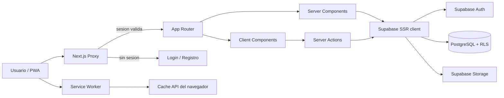

# Arquitectura

## Vista general

La aplicacion es un monolito Next.js con servicios administrados de Supabase. No hay Route Handlers, API REST propia, ORM ni proceso backend independiente.

## Stack

| Capa | Herramienta | Version declarada | Uso |
| --- | --- | --- | --- |
| Framework | Next.js | `16.2.10` | App Router, Server Components, Server Actions, Proxy y build Turbopack |
| UI | React / React DOM | `19.2.4` | Componentes cliente, `useActionState`, `useTransition` y estado local |
| Lenguaje | TypeScript | `^5` | Tipado estricto y alias `@/*` |
| Estilos | Tailwind CSS | `^4` | Utilidades y tokens definidos en `app/globals.css` |
| Datos | Supabase JS | `^2.110.7` | Auth, consultas PostgreSQL, RPC y Storage |
| SSR Auth | `@supabase/ssr` | `^0.12.3` | Clientes browser/server y sincronizacion de cookies |
| Graficos | Recharts | `^3.10.0` | Linea de progreso de peso |
| Iconos | Reicon React | `^1.1.302` | Iconografia de navegacion y acciones |
| Calidad | ESLint | `^9` | Reglas Next.js Core Web Vitals y TypeScript |

## Convenciones de Next.js 16

El proyecto aplica convenciones que difieren de versiones anteriores:

- `proxy.ts` es la convencion vigente; `middleware.ts` esta deprecado.
- `cookies()` es asincrono y se espera con `await` en el cliente Supabase de servidor.
- `params` y `searchParams` son promesas en paginas dinamicas.
- Las Server Actions se consideran endpoints `POST` accesibles directamente. Cada accion debe autenticar y autorizar, o depender deliberadamente de RLS.
- Las rutas que leen cookies mediante Supabase se renderizan dinamicamente.

Antes de modificar codigo se deben consultar las guias locales de `node_modules/next/dist/docs/`, segun `AGENTS.md`.

## Capas

### Presentacion

- `app/layout.tsx`: documento HTML, fuentes Geist, metadatos, tema y registro del service worker.
- `app/(auth)`: layout y pantallas publicas de autenticacion.
- `app/(app)`: layout autenticado, encabezado, perfil, cierre de sesion y navegacion inferior.
- `components/`: formularios y experiencias interactivas ejecutadas en el cliente.
- `app/globals.css`: tokens de color oscuros y estilos base de formularios.

La interfaz esta orientada a movil, con ancho de contenido maximo de `3xl` y navegacion inferior fija. No hay sistema de temas ni modo claro.

### Aplicacion

Las mutaciones viven en `app/actions/`:

| Modulo | Responsabilidad |
| --- | --- |
| `auth.ts` | Login, registro y logout |
| `onboarding.ts` | Guardar medidas iniciales y completar el onboarding |
| `perfil.ts` | Editar perfil y subir avatar |
| `rutinas.ts` | Crear/eliminar rutinas, dias y ejercicios |
| `registros.ts` | Registrar peso y repeticiones |
| `grupos.ts` | Crear, unirse y salir de grupos |

Los formularios principales usan `useActionState`; las interacciones del editor de rutina usan `useTransition`, llaman acciones y luego ejecutan `router.refresh()`.

### Acceso a datos

- `lib/supabase/server.ts` crea un cliente por solicitud con las cookies de Next.js.
- `lib/supabase/client.ts` expone un cliente de navegador, aunque actualmente ningun componente lo importa.
- Los Server Components consultan Supabase directamente y, cuando es posible, paralelizan lecturas con `Promise.all`.
- No hay repositorios, servicios de dominio ni tipos generados desde la base de datos.

### Persistencia

Supabase aporta Auth, PostgreSQL, RLS, funciones SQL, triggers y el bucket `avatars`. El detalle esta en [Datos y seguridad](./DATA-AND-SECURITY.md).

## Enrutamiento

| Ruta | Render | Acceso | Funcion |
| --- | --- | --- | --- |
| `/` | Estatico | Protegido por Proxy | Redirige a `/home` |
| `/login` | Estatico | Publico; usuario activo va a `/home` | Iniciar sesion |
| `/registro` | Estatico | Publico; usuario activo va a `/home` | Crear cuenta |
| `/onboarding` | Estatico | Usuario sin onboarding | Guardar peso y estatura |
| `/home` | Dinamico | Usuario con onboarding | Resumen y rutinas del dia |
| `/perfil` | Dinamico | Usuario con onboarding | Editar perfil y avatar |
| `/rutinas` | Dinamico | Usuario con onboarding | Listar rutinas propias |
| `/rutinas/nueva` | Estatico | Usuario con onboarding | Crear rutina |
| `/rutinas/[id]` | Dinamico | Propietario | Editar y ejecutar rutina |
| `/grupos` | Dinamico | Usuario con onboarding | Listar grupos del usuario |
| `/grupos/nuevo` | Estatico | Usuario con onboarding | Crear grupo |
| `/grupos/unirse` | Dinamico | Usuario con onboarding | Unirse por codigo o enlace |
| `/grupos/[id]` | Dinamico | Miembro | Panel compartido |

Hay `loading.tsx` para home, listados de rutinas/grupos y detalles dinamicos. No hay `error.tsx` de ruta ni pagina `not-found.tsx` personalizada.

## Flujo de solicitud

1. `proxy.ts` crea un cliente Supabase a partir de cookies y ejecuta `auth.getUser()`.
2. Sin usuario, solo `/login` y `/registro` permanecen accesibles.
3. Con usuario, las rutas publicas redirigen a `/home`.
4. El claim `user_metadata.onboarding_completo` decide entre `/onboarding` y la aplicacion.
5. La pagina lee los datos con el cliente Supabase de servidor.
6. RLS filtra las filas segun `auth.uid()` y membresias de grupo.
7. Una mutacion usa una Server Action, llama Supabase y redirige o revalida la ruta afectada.

## Componentes clave

| Componente | Rol |
| --- | --- |
| `RutinaEditor` | Maquina de vistas para dias, categorias, seleccion y ejercicios personalizados |
| `EjercicioRow` | Registro de series, ultimo valor, historial agrupado y expansion de detalle |
| `ProgresoChart` | Grafico de hasta 20 registros recientes |
| `CategoriaGrid` | Selector visual de cuatro grupos musculares |
| `PerfilForm` | Edicion de datos y previsualizacion/subida de avatar |
| `GrupoHeader` | Miembros, codigo y copia del enlace de invitacion |
| `NavTabs` | Navegacion persistente entre home, rutinas y grupos |
| `Avatar` | Imagen remota o iniciales con color determinista |

## Revalidacion y estado

- Tras actualizar dias, ejercicios o registros se usa `revalidatePath` y luego `router.refresh()` desde el cliente.
- Crear o eliminar recursos suele terminar con `redirect()`.
- El estado interactivo no se comparte globalmente; se mantiene dentro de cada componente.
- No se configura `use cache`, `cacheTag`, ISR ni una libreria de estado cliente.
