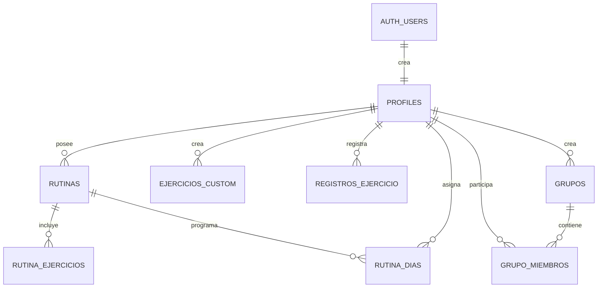

# Datos y seguridad

## Modelo relacional

El esquema fuente esta en `supabase/schema.sql`.

## Tablas

### `profiles`

Extension uno-a-uno de `auth.users`. Guarda nombre, apellido, `username` unico, peso, estatura, URL de avatar y estado del onboarding. La eliminacion del usuario elimina el perfil por cascada.

### `rutinas`

Cabecera de rutina con propietario, nombre y fecha de creacion. Sus ejercicios y dias se eliminan por cascada.

### `ejercicios_custom`

Catalogo privado de ejercicios creados por el usuario. Guarda nombre y categoria. No tiene referencia directa desde `rutina_ejercicios`; la relacion se conserva como texto en `ejercicio_id`.

### `rutina_ejercicios`

Detalle desnormalizado de una rutina: ID logico del ejercicio, nombre, indicador custom y orden. Esta decision permite mezclar ejercicios JSON y ejercicios SQL sin una tabla catalogo comun.

### `rutina_dias`

Relacion entre rutina, usuario y dia semanal (`0..6`). No existe una restriccion unica sobre rutina y dia; la aplicacion evita duplicados borrando y reinsertando la seleccion completa.

### `registros_ejercicio`

Serie historica con usuario, ID y nombre del ejercicio, peso, repeticiones opcionales y timestamp. Tiene indice compuesto por usuario, ejercicio y fecha descendente.

### `grupos`

Grupo con nombre, codigo de invitacion unico, creador y timestamp.

### `grupo_miembros`

Relacion muchos-a-muchos entre grupos y perfiles. La restriccion unica `(grupo_id, user_id)` hace idempotente la union repetida.

## Integridad y cascadas

- Las relaciones a `profiles` usan `on delete cascade`.
- Los detalles de rutina usan cascada desde `rutinas`.
- Las membresias usan cascada desde `grupos` y `profiles`.
- `dia_semana` acepta exclusivamente valores de 0 a 6.
- `rutinas.nombre`, datos basicos de ejercicios, peso y campos de grupo son obligatorios.
- `username` y `grupos.codigo` son unicos.

No hay checks SQL para peso/repeticiones positivos, longitud de nombres, categoria valida ni formato del codigo. Parte de esa validacion ocurre solo en UI o Server Actions.

## Row Level Security

RLS esta habilitado en las ocho tablas publicas.

| Recurso | Escritura | Lectura |
| --- | --- | --- |
| `profiles` | Solo el propio perfil | Propietario o usuario que comparte grupo |
| `rutinas` | Solo propietario | Propietario o usuario que comparte grupo |
| `ejercicios_custom` | Solo propietario | Solo propietario |
| `rutina_ejercicios` | Solo si la rutina pertenece al usuario | Propietario o usuario que comparte grupo con el dueño |
| `rutina_dias` | Solo propietario | Propietario o usuario que comparte grupo |
| `registros_ejercicio` | Solo propietario | Propietario o usuario que comparte grupo |
| `grupos` | Insert del creador | Miembro o creador |
| `grupo_miembros` | Sin insert directo; delete propio | Miembros del mismo grupo |

Las politicas propias y compartidas son aditivas: PostgreSQL permite la fila cuando cualquier politica aplicable resulta verdadera.

## Funciones SQL

### `is_grupo_member(p_grupo_id)`

Funcion `security definer` que comprueba si `auth.uid()` pertenece al grupo. Evita recursion de RLS al consultar `grupo_miembros` desde sus propias politicas.

### `comparte_grupo_con(p_user_id)`

Funcion `security definer` que determina si el usuario activo comparte al menos un grupo con otro perfil. Habilita las politicas de lectura social.

### `unirse_a_grupo(p_codigo)`

RPC `security definer` que:

1. Exige un usuario autenticado.
2. Normaliza el codigo a mayusculas.
3. Busca el grupo por codigo.
4. Inserta la membresia de forma idempotente.
5. Devuelve ID y nombre del grupo.

Es la unica via de insercion de membresias para clientes autenticados.

## Triggers

| Trigger | Evento | Efecto |
| --- | --- | --- |
| `on_auth_user_created` | Nuevo `auth.users` | Crea `profiles` desde metadata de registro |
| `on_grupo_created` | Nuevo `grupos` | Agrega al creador como primer miembro |

Ambos handlers son `security definer` con `search_path = public`.

## Storage

El bucket publico `avatars` admite PNG, JPEG y WebP hasta 10 MB. El nombre esperado empieza con el UUID del usuario.

- Insert, update, delete y select de objetos requieren que la primera carpeta sea `auth.uid()`.
- La politica select del propietario permite que `upsert ... returning` funcione.
- El bucket es publico: una URL conocida puede leerse sin autenticacion, aunque la lista de objetos no queda abierta por una politica publica.

## Fronteras de seguridad

1. Proxy controla navegacion y refresca sesion, pero no reemplaza autorizacion por recurso.
2. Las Server Actions son invocables como `POST` directo. Varias autentican con `getUser()`; otras dependen de RLS para impedir escrituras ajenas.
3. RLS es la barrera principal contra acceso horizontal entre usuarios.
4. Las funciones `security definer` deben mantener un `search_path` fijo y una logica minima porque omiten RLS internamente.
5. Solo se usan claves publicas `NEXT_PUBLIC_*`; no hay service role en la aplicacion.

## Consideraciones actuales

- Varias mutaciones no inspeccionan el error retornado por Supabase, de modo que la UI puede parecer exitosa aunque RLS o la base rechacen la operacion.
- `agregarEjercicios` y `quitarEjercicio` no vuelven a ejecutar `auth.getUser()`; su autorizacion efectiva depende de RLS.
- El indicador de onboarding existe en perfil y metadata Auth, con riesgo de divergencia si una de las dos escrituras falla.
- El esquema es un archivo de bootstrap idempotente parcial, no una secuencia versionada de migraciones.
- No hay tipos TypeScript generados desde Supabase; cambios de columnas pueden fallar solo en ejecucion.
- El codigo de grupo usa `Math.random()` y seis caracteres. Es una invitacion practica, no un secreto criptografico.
- El service worker almacena respuestas `GET` autenticadas en el cache local del navegador.
